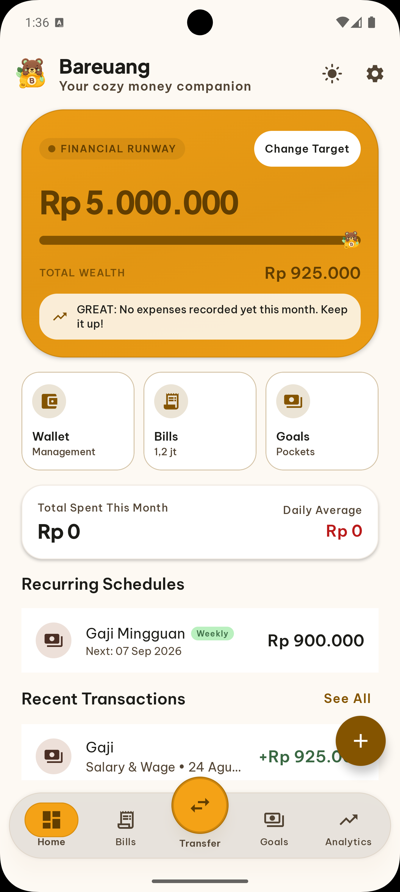
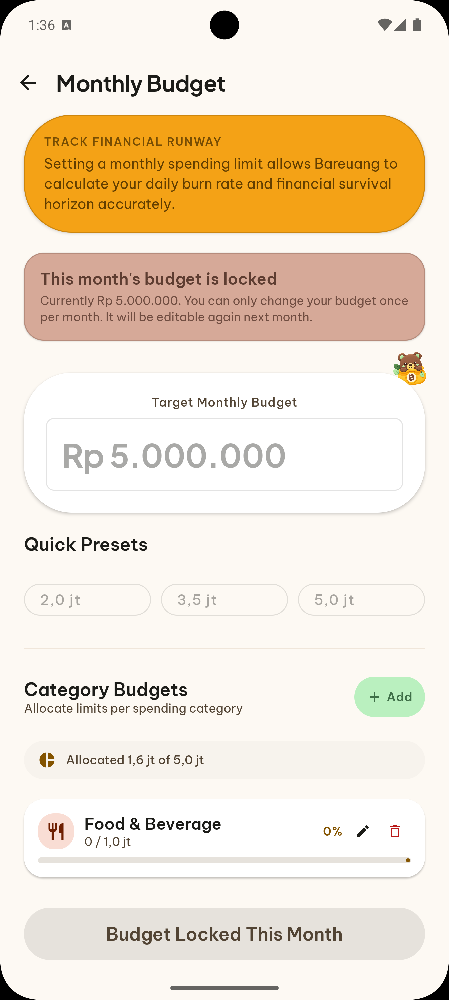
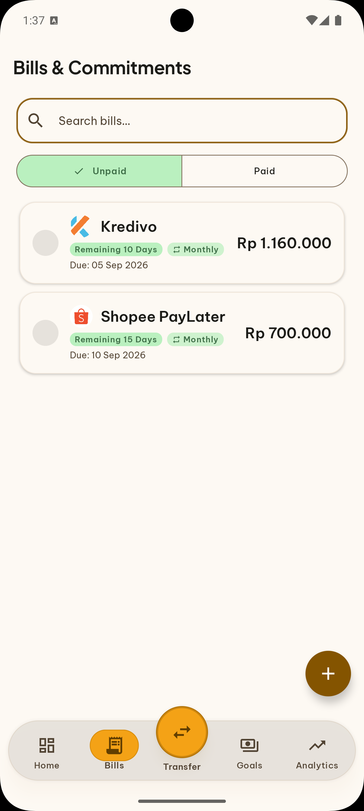
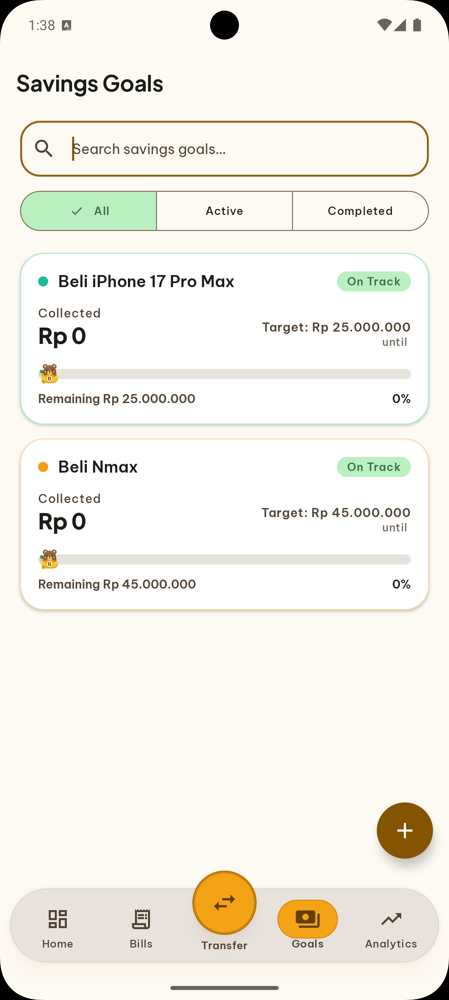
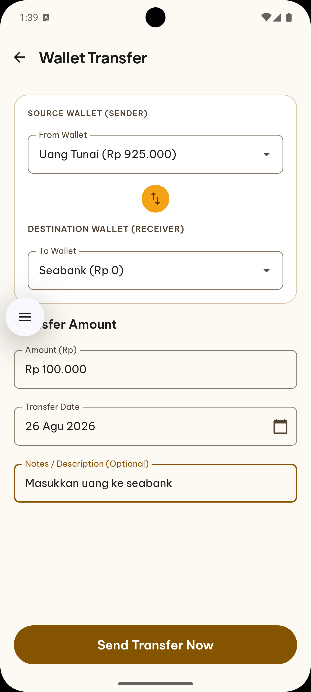
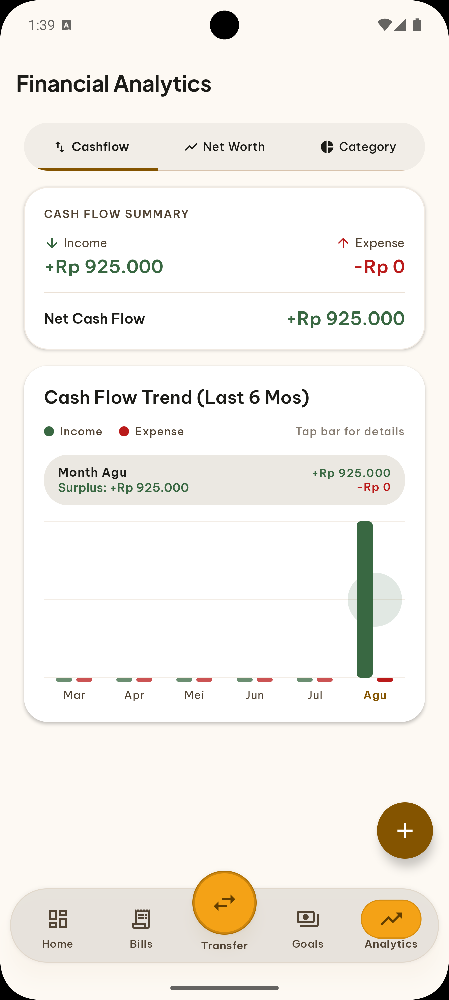

<div align="center">
  

  # Bareuang
  **Teman cozy buat uangmu · Your cozy money companion**

  *Tahu sampai kapan uangmu tahan, kelola banyak dompet, pantau tagihan, dan wujudkan target tabungan — bersama si beruang madu.*

  ---

  [](https://kotlinlang.org/)
  [](https://developer.android.com/jetpack/compose)
  []()
  []()

</div>

---

## Mengapa Bareuang?

Kebanyakan aplikasi keuangan terasa seperti spreadsheet — dingin dan membebani. Bareuang hadir untuk membalikkan itu.

Satu pertanyaan sederhana jadi fondasinya: **"Dengan pola pengeluaranku sekarang, sampai kapan uangku tahan?"** — dan beruang madu akan menjawabnya lewat fitur **Financial Runway**.

Semua data **100% tersimpan lokal**, tanpa server, tanpa akun, tanpa izin internet.

---

## ✨ Fitur

| | Fitur | Deskripsi singkat |
|---|---|---|
| 📊 | **Financial Runway** | Hitung *burn rate* harian & prediksi kapan saldo habis (*Estimated Death Day*) |
| 🏷️ | **Monthly & Category Budget** | Kunci anggaran bulanan + atur limit per kategori pos pengeluaran (*Food, Transport, dll*) |
| 💰 | **Multi-Wallet** | Kelola Tunai, BCA, GoPay, OVO, dll — kalkulasi total *net worth* real-time |
| 🔄 | **Transfer Antar Dompet** | Smart switch anti-duplikasi + 1-tap swap dompet dari bar navigasi cepat |
| 📥 | **Import Mutasi CSV** | Impor transaksi dari BCA / e-wallet (delimiter `,`/`;`, debit-kredit terpisah, 8 format tanggal, dedup, guard saldo & budget, index DB) |
| 🧾 | **Scan Struk Belanja (OCR)** | Foto struk → ML Kit on-device (layout-aware, standalone `text-recognition`), preview kertas termal asli, edit merchant/total/category, currency `Rp` real-time, perbaiki teks manual |
| 🎯 | **Savings Goals** | Target tabungan dengan kalkulator nominal cerdas, alokasi setor (*deposit*) & tarik (*withdraw*) |
| 📋 | **Bill Reminder** | Pengingat tagihan rutin, notifikasi jatuh tempo H-3, auto-rollover, & auto-refund jika batal bayar |
| 🤝 | **Split Bill** | Hitung patungan makan/belanja bareng teman (pajak & service charge) + 1-klik share ke WhatsApp |
| 💱 | **Currency (IDR / USD)** | Pilih mata uang utama (Rupiah / Dollar) sejak Onboarding — dapat diubah kapan saja di Pengaturan, format `Rp`/`$` konsisten di seluruh input |
| 🌓 | **Theme Mode** | Pilihan tema Terang, Gelap, atau Ikuti Sistem — dapat disetel sejak Onboarding |
| 📦 | **Backup & Restore** | Cadangkan dan pulihkan seluruh data keuangan secara offline via file `.json` |
| 🌐 | **Bilingual (ID / EN)** | Pilihan Bahasa Indonesia & English yang berganti seketika tanpa jeda (*zero-blink*) |
| 📈 | **Financial Analytics** | Visualisasi tren *Cashflow*, riwayat *Net Worth*, dan distribusi pengeluaran per kategori |
| 🏠 | **Home Widget** | Widget beruang interaktif di layar utama: pantau sisa runway, saldo, & tagihan harian |

> **Budget Gate** — pencatatan transaksi baru aktif setelah budget bulan berjalan diatur. Hal ini memastikan Financial Runway dan estimasi hari bertahan selalu memiliki data acuan yang akurat. Import CSV & Scan Struk juga melewati gate + cek saldo (fail-fast) via `BulkCreateTransactionsUseCase` dan `OcrScanViewModel`.

**Import & OCR — 100% Offline:** Tanpa `INTERNET`, tanpa server. CSV `5MB` guard + `DocumentFile` name, `parseWithStats` + `getByDates` dedup, bulk insert 1 transaksi DB (`bulkCreate`), `ImportPreferences` counter. OCR `InputImage.fromFilePath` + `Dispatchers.IO` + zigzag receipt preview + `AmountTextField` (`CurrencyVisualTransformation`).

---

## 📸 Screenshots

<div align="center">

<table>
  <tr>
    <td align="center"></td>
    <td align="center"></td>
    <td align="center"></td>
  </tr>
  <tr>
    <td align="center"><sub><b>Dashboard & Financial Runway</b></sub></td>
    <td align="center"><sub><b>Monthly Budget</b></sub></td>
    <td align="center"><sub><b>Bills & Commitments</b></sub></td>
  </tr>
  <tr>
    <td align="center"></td>
    <td align="center"></td>
    <td align="center"></td>
  </tr>
  <tr>
    <td align="center"><sub><b>Savings Goals</b></sub></td>
    <td align="center"><sub><b>Wallet Transfer</b></sub></td>
    <td align="center"><sub><b>Financial Analytics</b></sub></td>
  </tr>
</table>

</div>

---

## 🏛️ Arsitektur

```
Bareuang/
├── app/           # Composition root, Application entry
├── domain/        # Pure Kotlin — entities, repository ports, use-cases
├── data/          # Room DB, Backup JSON, WorkManager notifications
├── presentation/  # Jetpack Compose UI, ViewModels, Hilt Navigation
└── web/           # Landing page + Privacy/Terms (static, no build)
    ├── index.html      # Landing 1 halaman (ID/EN, responsive, SEO)
    ├── privacy.html    # Privacy Policy — 100% offline
    ├── terms.html      # Terms of Service + Disclaimer
    ├── css/style.css   # Single stylesheet, no framework
    ├── js/main.js      # ~30 lines + i18n dict
    └── assets/         # Logo & screenshots (reuse dari art/)
```

**Stack Android:** Kotlin 2.0 · Jetpack Compose · Room (index `date/amount/merchant`) · Hilt · WorkManager · Glance Widget · Gson · CameraX · ML Kit `text-recognition` (standalone, on-device)

**Stack Web:** Pure HTML/CSS/JS — tanpa framework, tanpa build step, tanpa `node_modules`. Deploy ke GitHub Pages / Cloudflare Pages. SEO: canonical, hreflang ID/EN, OG/Twitter, JSON-LD (SoftwareApplication, FAQPage, Organization, Breadcrumb), sitemap.xml, robots.txt.

---

## 🚀 Menjalankan Project

Tidak perlu konfigurasi — tanpa API key, tanpa `google-services.json`, tanpa server.

```bash
# Debug
./gradlew installDebug

# Release APK (butuh keystore.properties)
./gradlew :app:assembleRelease

# AAB untuk Play Store
./gradlew :app:bundleRelease
```

### 🌐 Web — Landing Page

```bash
# Preview lokal (tanpa build)
python3 -m http.server --directory web 8000
# buka http://localhost:8000

# Struktur
# web/index.html    → landing 1 halaman (bilingual ID/EN toggle, responsive, smooth reveal)
# web/privacy.html  → Privacy Policy (Play Store compliant, no data collected)
# web/terms.html    → Terms + Disclaimer keuangan
# web/sitemap.xml + robots.txt → SEO
```

Deploy: push `web/` ke GitHub Pages (Settings → Pages → Deploy from `/web`) atau connect repo ke Cloudflare Pages (root `web`). Ganti `https://bareuang.app` di `web/index.html`, `privacy.html`, `terms.html`, `sitemap.xml` jika pakai domain lain. URL Privacy/Terms dipakai di Play Console → Data safety & Store listing.

<details>
<summary>Setup keystore untuk release build</summary>

1. Generate keystore:
   ```bash
   keytool -genkey -v -keystore keystores/bareuang-release.keystore \
     -alias bareuang -keyalg RSA -keysize 4096 -validity 10000
   ```
2. Buat `keystore.properties` di root (sudah di-gitignore):
   ```properties
   storeFile=keystores/bareuang-release.keystore
   storePassword=****
   keyAlias=bareuang
   keyPassword=****
   ```

Untuk CI/CD GitHub Actions, tambahkan 4 secret: `SIGNING_KEYSTORE_BASE64`, `KEYSTORE_PASSWORD`, `KEY_ALIAS`, `KEY_PASSWORD`.

</details>

---

## 📄 Lisensi

MIT License — lihat file [`LICENSE`](LICENSE) untuk detail.

<div align="center">
  <sub>Dibuat dengan ❤️ oleh <a href="https://github.com/Udean777">Udean777</a></sub>
</div>
