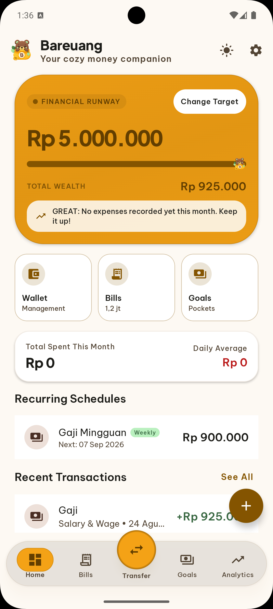
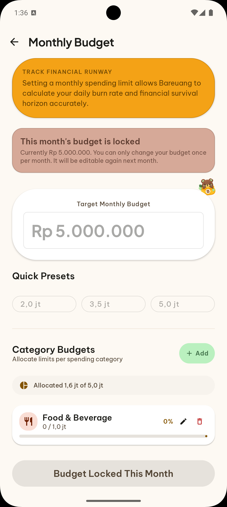
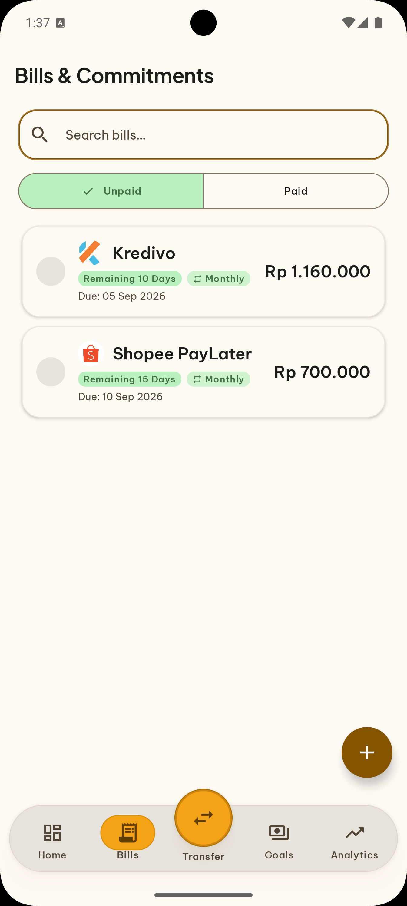
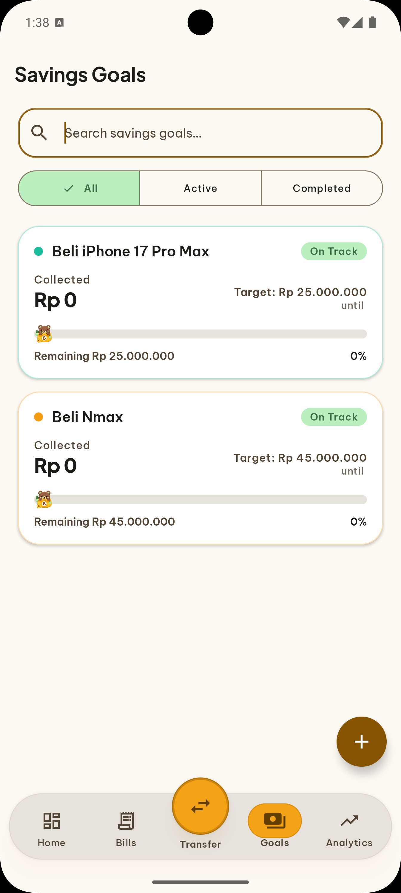
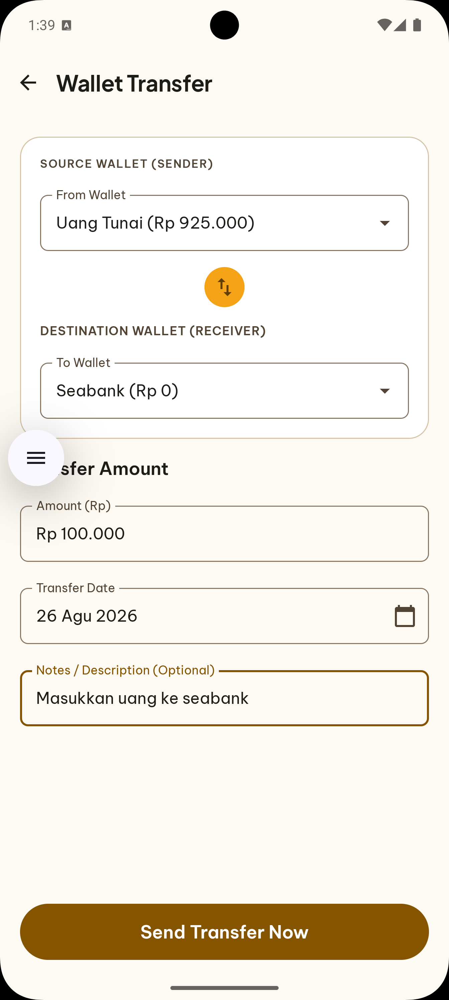
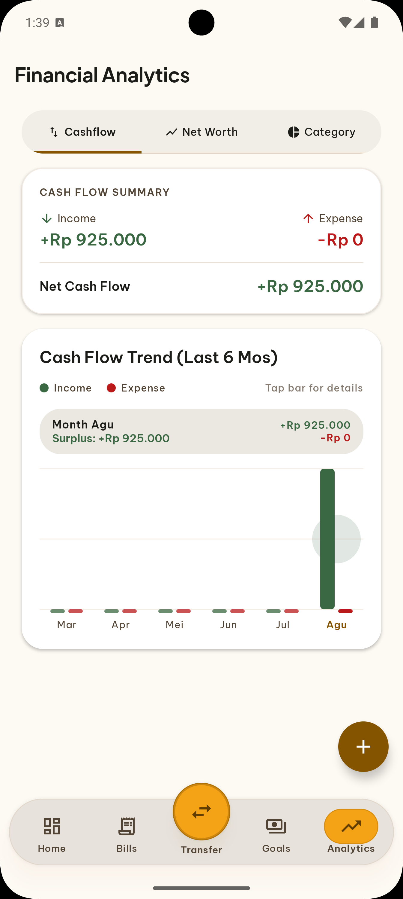

<div align="center">
  

  # Bareuang
  **Your cozy money companion**

  *An offline-first Android personal finance app for tracking budgets, wallets, bills, savings goals, and financial runway.*

  *Know how long your money will last, manage multiple wallets, track bills, and reach your savings goals—with a friendly honey bear.*

  ---

  [](https://kotlinlang.org/)
  [](https://developer.android.com/jetpack/compose)
  []()
  []()

</div>

---

## Why Bareuang?

Many finance apps feel like cold, overwhelming spreadsheets. Bareuang takes a friendlier approach.

It starts with one simple question: **“With my current spending habits, how long will my money last?”** Bareuang answers it with its **Financial Runway** feature.

Core financial data is **stored locally** on your device. Receipt scanning is optional and processes images on-device with ML Kit. Bareuang has no accounts, sign-in, cloud sync, or multi-user profiles: the app is **guest-only**. Reset Local Data in Settings to erase the app's local data.

### OCR privacy

- Receipt photos are processed on-device with ML Kit in all app builds.
- Receipt photos are never sent to a server or AI provider.
- The bundled OCR model requires no first-run download and works offline.
- Manual entry is always available if OCR is unavailable or fails.
- Full policy: [Privacy Policy](https://bareuang.app/privacy.html).

---

## ✨ Features

| | Feature | Description |
|---|---|---|
| 📊 | **Financial Runway** | Calculate your daily burn rate and estimate when your balance will run out (*Estimated Death Day*). |
| 🏷️ | **Monthly & Category Budgets** | Set a monthly budget and limits for spending categories such as food and transport. |
| 💰 | **Multiple Wallets** | Manage cash, BCA, GoPay, OVO, and more, with your combined net worth calculated in real time. |
| 🔄 | **Wallet Transfers** | Switch wallets without duplicate entries, or swap the selected wallets with one tap. |
| 📥 | **CSV Statement Import** | Import transactions from BCA and e-wallets (`,`/`;` delimiters, separate debit and credit columns, eight date formats, deduplication, balance and budget guards, and database indexing). |
| 🧾 | **Receipt Scanning (OCR)** | Scan a receipt with on-device ML Kit, preview and edit the merchant, total, and category, and save it locally with the current currency. |
| 🎯 | **Savings Goals** | Set savings goals with a smart amount calculator and deposit or withdrawal allocations. |
| 📋 | **Bill Reminders** | Track recurring bills, get reminders three days before they are due, and use automatic rollover and refunds when a payment is cancelled. |
| 🤝 | **Split Bills** | Split a meal or shopping bill, including tax and service charges, then share it on WhatsApp with one tap. |
| 💱 | **IDR / USD Currency** | Choose Rupiah or US dollars during onboarding or later in Settings. Currency formatting stays consistent across inputs. |
| 🌓 | **Theme** | Choose Light, Dark, or Follow System during onboarding. |
| 📦 | **Backup & Restore** | Back up and restore all financial data offline using a `.json` file. |
| 🌐 | **Indonesian & English** | Switch between Indonesian and English instantly, without a visible flash. |
| 📈 | **Financial Analytics** | Explore cash flow trends, net worth history, and spending by category. |
| 🏠 | **Home Screen Widget** | Use the interactive bear widget to check your remaining runway, balance, and daily bills. |

> **Budgets & runway:** Transactions can still be recorded before a budget is set. Runway estimates become available after you set a monthly budget. CSV imports and receipt scans validate data before saving transactions.

**Offline imports, optional offline OCR:** CSV import has a `5 MB` size limit, reads document names through `DocumentFile`, and uses `parseWithStats` and `getByDates` for deduplication. It inserts transactions in one database operation (`bulkCreate`) and tracks counts in `ImportPreferences`. Receipt scanning uses on-device ML Kit; you can edit the results before saving them locally.

---

## 📸 Screenshots

<div align="center">

<table>
  <tr>
    <td align="center"></td>
    <td align="center"></td>
    <td align="center"></td>
  </tr>
  <tr>
    <td align="center"><sub><b>Dashboard &amp; Financial Runway</b></sub></td>
    <td align="center"><sub><b>Monthly Budget</b></sub></td>
    <td align="center"><sub><b>Bills &amp; Commitments</b></sub></td>
  </tr>
  <tr>
    <td align="center"></td>
    <td align="center"></td>
    <td align="center"></td>
  </tr>
  <tr>
    <td align="center"><sub><b>Savings Goals</b></sub></td>
    <td align="center"><sub><b>Wallet Transfer</b></sub></td>
    <td align="center"><sub><b>Financial Analytics</b></sub></td>
  </tr>
</table>

</div>

---

## 🏛️ Architecture

```
Bareuang/
├── app/           # Composition root, application entry point
├── domain/        # Pure Kotlin: entities, repository ports, and use cases
├── data/          # Room database, JSON backups, and WorkManager notifications
├── presentation/  # Jetpack Compose UI, ViewModels, and Hilt navigation
└── web/           # Static landing page, Privacy Policy, and Terms
    ├── index.html      # Responsive bilingual landing page with SEO metadata
    ├── privacy.html    # Privacy Policy for local data and OCR
    ├── terms.html      # Terms of Service and disclaimer
    ├── css/style.css   # Single stylesheet; no framework
    ├── js/main.js      # Page interactions and language switching
    └── assets/         # Logo and screenshots shared with art/
```

Module dependency rules and Android test placement are documented in [docs/architecture.md](docs/architecture.md). Check module boundaries with `./gradlew verifyArchitectureBoundaries`.

**Android stack:** Kotlin 2.0 · Jetpack Compose · Room v16 (historical migrations and guest-only schema) · Hilt · WorkManager · Glance Widget · Gson · ML Kit Text Recognition (bundled, on-device)

**Web stack:** Plain HTML/CSS/JS, with no framework, build step, or `node_modules`. Deploy to GitHub Pages or Cloudflare Pages. SEO includes canonical URLs, ID/EN hreflang, Open Graph/Twitter metadata, JSON-LD (SoftwareApplication, FAQPage, Organization, Breadcrumb), a sitemap, and robots.txt.

---

## 🚀 Getting started

Core features do not require an account. On-device OCR is available in debug and release builds and works without an internet connection.

```bash
# Debug
./gradlew installDebug

# Release APK and AAB (requires signing configuration and version inputs)
VERSION_CODE=2 VERSION_NAME=1.0.1 ./gradlew :app:assembleRelease :app:bundleRelease

# Local checks
./gradlew test
./gradlew lint
```

CI runs JVM unit tests and lint without an emulator. To build a release APK and AAB, manually run the **Build APK & AAB** workflow from the Actions tab.

### 🌐 Website and landing page

```bash
# Local preview (no build step)
python3 -m http.server --directory web 8000
# Open http://localhost:8000

# Key files
# web/index.html    → one-page landing site with ID/EN toggle and responsive reveal effects
# web/privacy.html  → Privacy Policy for local data and OCR
# web/terms.html    → Terms and financial disclaimer
# web/sitemap.xml + robots.txt → SEO
```

Deploy `web/` to GitHub Pages (Settings → Pages → Deploy from `/web`) or connect the repository to Cloudflare Pages with `web` as the root directory. If you use another domain, update `https://bareuang.app` in `web/index.html`, `privacy.html`, `terms.html`, and `sitemap.xml`. Privacy and Terms URLs are used in Play Console for Data safety and the Store listing.

The **Build APK & AAB** workflow only asks for `version_name`. It generates the version code from the `PLAY_VERSION_CODE_BASE` repository variable plus the workflow run number. Set that variable to the highest version code already uploaded to Play; each subsequent run receives a higher number. The workflow builds an AAB for Play Console and a sideloadable APK, verifies their signatures, and includes `SHA256SUMS.txt` in the GitHub Release. Store the upload certificate fingerprint in a secrets manager, not in the repository.

<details>
<summary>Release keystore setup</summary>

1. Generate a keystore:
   ```bash
   keytool -genkey -v -keystore keystores/bareuang-release.keystore \
     -alias bareuang -keyalg RSA -keysize 4096 -validity 10000
   ```
2. Create `keystore.properties` in the project root (already included in `.gitignore`):
   ```properties
   storeFile=keystores/bareuang-release.keystore
   storePassword=****
   keyAlias=bareuang
   keyPassword=****
   ```

For GitHub Actions CI/CD, add these four secrets: `SIGNING_KEYSTORE_BASE64`, `KEYSTORE_PASSWORD`, `KEY_ALIAS`, and `KEY_PASSWORD`.

</details>

---

## 📄 License

MIT License. See [`LICENSE`](LICENSE) for details.

<div align="center">
  <sub>Made with ❤️ by <a href="https://github.com/Udean777">Udean777</a></sub>
</div>
